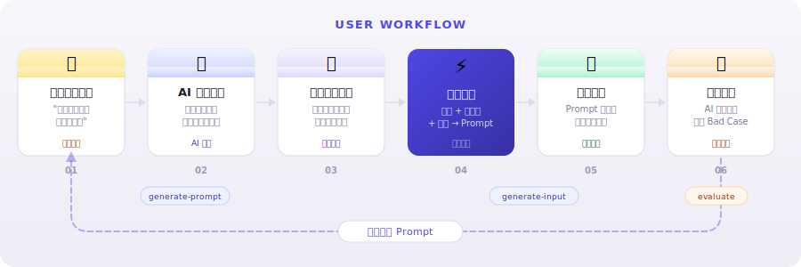
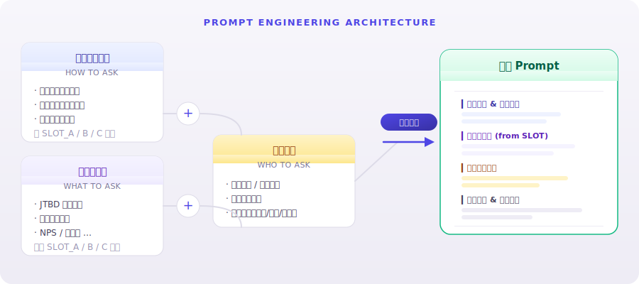
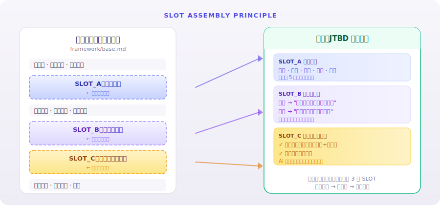

<div align="center">

# AI Interview Kit

**Professional-grade user interviews at scale —<br>powered by prompt engineering, not bigger budgets.**

<br>

**34 → 94 %** follow-up hit rate &ensp;·&ensp; **50+** iteration rounds &ensp;·&ensp; **2 500+** production calls

<br>

<a href="#quick-start"></a>&ensp;
<a href="./LICENSE"></a>&ensp;
<a href="#compatibility"></a>&ensp;
<a href="#methodology-library"></a>

<br>

**[中文版 →](./README_zh.md)**

<br><br>


<sub>50 s demo &ensp;·&ensp; research question → auto-classify → pick methodology → generate full prompt</sub>

</div>

<br>

---

<br>

<a id="quick-start"></a>

## ⚡ Quick Start

```bash
git clone https://github.com/CyannSHI/ai-interview-kit.git
cd ai-interview-kit
# Open with any supported AI tool and say "generate prompt"
```

| Skill | Trigger | What It Does |
|:--|:--|:--|
| `generate-prompt` | "generate prompt" / "new project" | Guided info collection → methodology pick → auto-assembled prompt |
| `generate-input` | "prepare input variables" | Natural language → structured input variables |
| `evaluate` | "evaluate calls" | Batch review call transcripts; detect bad cases & output Excel report |

<div align="center">
  
</div>

<br>

---

<br>

## Who It's For

<table>
<tr>
<td width="50%">

### UX Researchers

Your ceiling: 5–8 deep interviews a week. Outsourcing just trades one problem for another. When the budget runs out, sample size gets cut — quality never goes up.

</td>
<td width="50%">

### PMs & Founders

You know you should talk to users — but what do you ask, and how deep do you go? ChatGPT gives surface-level answers that dead-end after two turns. You finally invest the time, only to realize you missed every key question.

</td>
</tr>
</table>

> **The idea:** engineer research methodologies into AI prompts. Non-experts get professional interview quality. Experts get 10× scale.

<br>

---

<br>

## 🎯 Core Innovation — AI Control Precision

Most AI interview prompts are either too rigid or too loose. Different goals need different AI latitude — and seasoned researchers dial this by instinct. **We parameterized that instinct.**

<br>

<div align="center">

```
AI freedom:   Low ◄━━━━━━━━━━━━━━━━━━━━━━━━━━━━━━━━━━━━► High

              Precise Control       Balanced Mode        Exploratory Mode
              confirmatory          most projects        discovery
```

</div>

<br>

|  | Precise Control | Balanced | Exploratory |
|:--|:--:|:--:|:--:|
| **Use case** | Targeted validation | Clear direction, some flex | Open-ended discovery |
| **Key-info markers** | Per question | Per question | None — AI decides |
| **Probing limit** | 4 rounds / Q | 6 rounds / Q | AI discretion |
| **Min coverage** | 80 % required Qs | 75 % | 60 % |
| **Example** | NPS callback | JTBD migration | New-product exploration |

<sub>We distilled interviewers' tacit knowledge — when to drill down, when to skip, when to follow a thread — into three tunable parameters: info-point density, probing-round cap, and minimum coverage rate.</sub>

<br>

---

<br>

## 🧩 How It Works — Prompt Engineering Architecture

<div align="center">
  
</div>

<br>

<div align="center">
  <strong>Universal framework</strong> (how to ask) &ensp;+&ensp; <strong>Pluggable methodology</strong> (what to ask) &ensp;+&ensp; <strong>Project variables</strong> (whom to ask)<br>→ auto-assembled into a production-ready prompt
</div>

<br>

### The SLOT Mechanism

<div align="center">
  
</div>

<br>

> Add a new methodology by writing just 3 SLOTs — no framework changes needed. Framework upgrades automatically benefit every methodology.

<br>

---

<br>

<a id="methodology-library"></a>

## 📚 Methodology Library

| Methodology | Best For | Core Dimensions |
|:--|:--|:--|
| **JTBD Migration** | User decisions · churn · competitor switching | Push · Pull · Anxiety · Habit · Destination |
| **Journey Mapping** | Experience flows · friction points · action chains | Stage · Touchpoint · Behavior · Emotion · Breakpoint |
| **NPS / Satisfaction** | Satisfaction callback · service improvement | Positive driver · Negative driver · Expectation gap |
| **Laddering** | Deep motivation · value discovery | Attribute · Functional benefit · Emotional benefit · Core value |
| **User Lifecycle** | Conversion · retention · churn | Acquisition · Conversion · Usage · Retention · Churn |
| **Brand Diagnostics** | Brand perception · competitive positioning | Awareness · Association · Preference · Comparison · Loyalty |

<sub>Custom methodology? Copy <code>methodologies/_template.md</code>, fill in 3 SLOTs, save — done.</sub>

<br>

---

<br>

## 📊 Validation — Iterated Through 50+ Experiments

```text
v0.1  ███████░░░░░░░░░░░░░  34%   Flat question list — no probing
v0.2  ████████████░░░░░░░░  61%   + Key-info markers
v0.3  ██████████████████░░  89%   + Probing cap & 3-strike rule
v0.4  ███████████████████░  94%   + Methodology SLOT mechanism
```

<br>

### Problems Discovered

<table>
<tr>
<td width="50%">

<div align="center"><strong>Low-quality small-talk — users roll their eyes</strong></div>

<br>


<sub>User: "Train-ticket scalping doesn't even matter… what are you asking?"</sub>

</td>
<td width="50%">

<div align="center"><strong>Broken pacing — too many questions at once</strong></div>

<br>


<sub>AI asked 3 questions in one turn; the user only answered the last one.</sub>

</td>
</tr>
</table>

<br>

### After Optimization

<table>
<tr>
<td width="50%">

<div align="center"><strong>Precise summarization — real-time synthesis, zero leakage</strong></div>

<br>


<sub>AI consolidates scattered key info — booking channels, decision factors, membership perception, desired benefits — user responds "yes, exactly!"</sub>

</td>
<td width="50%">

<div align="center"><strong>Layer-by-layer drill-down — from vague complaints to concrete events</strong></div>

<br>


<sub>From one vague complaint, AI drills down in 3 steps: city → hotel → specific incident.</sub>

</td>
</tr>
<tr>
<td width="50%">

<div align="center"><strong>Natural expansion — context-aware topic transitions</strong></div>

<br>


<sub>AI naturally extends from hotel booking experience to cross-channel price comparisons — smooth and unforced.</sub>

</td>
<td width="50%">

<div align="center"><strong>Targeted probing — stays on point, layer after layer</strong></div>

<br>


<sub>AI probes the reason behind "two channels," drilling into price differences step by step.</sub>

</td>
</tr>
</table>

<br>

<details>
<summary>&ensp;<strong>Stress-test plan: 6 extreme scenarios</strong></summary>

<br>

| # | Scenario | What It Tests |
|:-:|:--|:--|
| 1 | **Memory activation** | Can AI gently help users recall when they say "I don't remember"? |
| 2 | **Deep drill-down without leading** | Can AI ask purely open-ended questions — no options, no nudging? |
| 3 | **Factual contradiction detection** | Can AI catch and probe when users contradict themselves? |
| 4 | **High-pressure emotion handling** | Can AI de-escalate anger and steer back on track? |
| 5 | **Signal extraction from noise** | Can AI identify key info when users ramble? |
| 6 | **Identity stability under challenge** | How does AI respond when users ask "Are you a robot?" |

**Evaluation dimensions:** pacing · probing depth · information leakage · abnormal hang-up rate · prompt robustness

</details>

<details>
<summary>&ensp;<strong>Production validation data</strong></summary>

<br>

| Metric | Industry Baseline | Project A (Test) | Project B (Prod) | Project C (Prod) |
|:--|:--:|:--:|:--:|:--:|
| Call volume | 50–100 / day | **1 267** | **202** | **1 031** |
| Connect rate | 30–40 % | 47 % | **61 %** | 51 % |
| Effective interview rate | 10–15 % | 6 % | **21 %** | 7 % |
| Time cost | 1–2 ppl × 2–3 days | 2 lines × 4 h | 2 lines × 30 min | 2 lines × 3.5 h |

> Project B achieved **21 %** effective interview rate — above the industry baseline of 10–15 %.

</details>

<br>

---

<br>

## 🔄 Feedback Loop — Review → Iterate

The campaign isn't the finish line. Feed call transcripts back to AI — say *"evaluate this campaign"* or *"find bad cases"* — and it returns an Excel report with per-call scoring, issue pinpointing, and concrete improvement suggestions that feed directly into your next prompt iteration.

<br>

---

<br>

<a id="compatibility"></a>

## 🔌 Compatibility

All skills are written in **plain natural language** — zero API dependencies, auto-compatible with major AI coding tools:

| AI Tool | Entry File |
|:--|:--|
| **Qoder** | `AGENTS.md` → `.qoder/skills/` |
| **Claude Code** | `CLAUDE.md` |
| **Cursor** | `.cursor/rules/ai-interview-skills.mdc` |
| **GitHub Copilot** | `.github/copilot-instructions.md` |
| **Windsurf** | `.windsurfrules` |
| **Others** | `INSTRUCTIONS.md` |

<sub>Every entry file points to <code>skills/</code> — skill logic lives in one place, zero duplication.</sub>

<br>

---

<br>

<details>
<summary>&ensp;<strong>Project Structure</strong></summary>

<br>

```
.
├── skills/                     # Skill instructions (single source of truth)
│   ├── generate-prompt.md      #   Prompt generation
│   ├── generate-input.md       #   Input variable generation
│   └── evaluate.md             #   Call quality evaluation
├── framework/
│   └── base.md                 # Universal interview framework (with SLOT placeholders)
├── methodologies/              # Methodology library (pluggable)
│   ├── jtbd.md                 #   JTBD Migration
│   ├── journey.md              #   Journey Mapping
│   ├── nps.md                  #   NPS / Satisfaction
│   ├── laddering.md            #   Laddering
│   ├── lifecycle.md            #   User Lifecycle
│   └── brand.md                #   Brand Diagnostics
├── examples/                   # Example files
└── assets/                     # Image assets
```

</details>

<br>

## Contributing

Issues and PRs welcome — especially new methodology modules, real-world case studies, and improvements to the probing logic.

<br>

---

<div align="center">

<br>

**Vision: Democratize Insight**

Let bootstrapped startups and nonprofits — teams that can't afford a research agency —<br>
hear their users at low cost, so product design truly returns to *human-centered*.

<br>

If this project helps you, consider giving it a ⭐

<br>

<a href="./LICENSE">MIT License</a>

<br><br>

</div>
